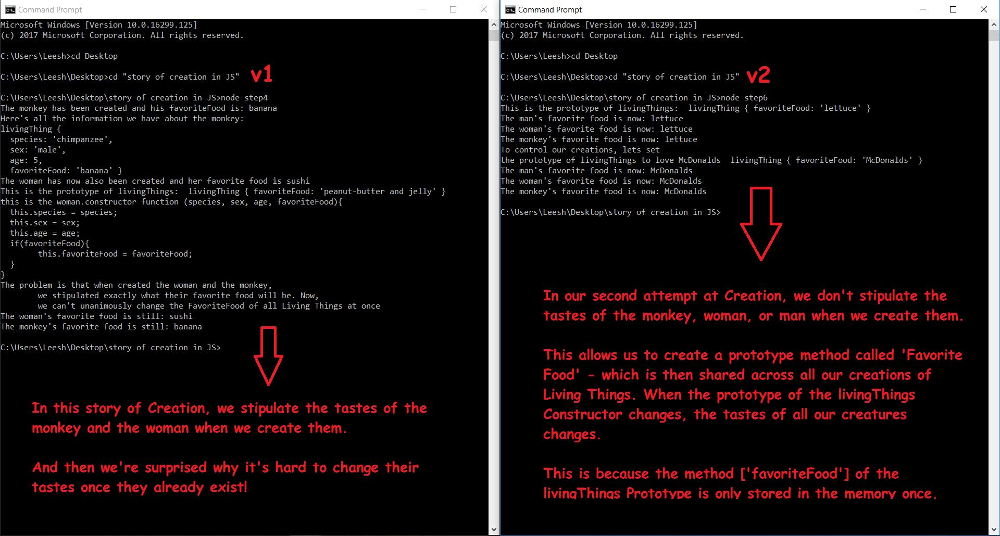
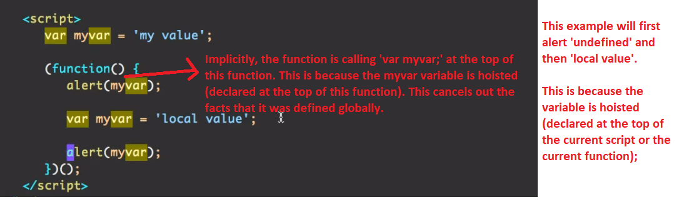
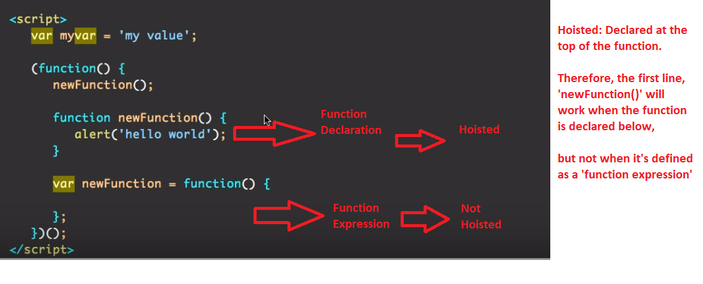
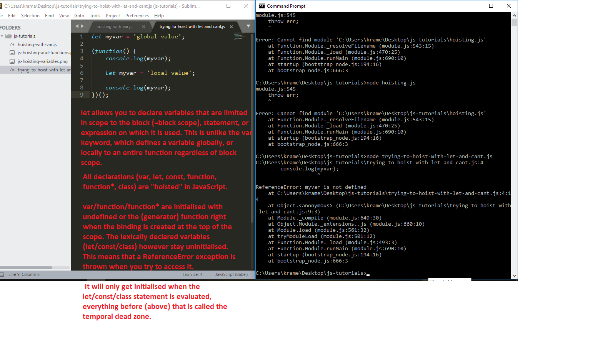

<h1>The Story of Creation (with JS)</h1>

In this tutorial, we'll play the role of God as he embarks on creating his world.

As we begin to construct our creatures, we have several things we need to take into account:

a) Should our Creatures have free will?
b) How unique should each instance of a creature be (i.e. Should all monkies love bananas? Or, will some monkeys prefer mangoes?)
c) How will we categorize our creatures (Species? Sex? Age?)
d) What is the lowest common denominator[s] of all living creatures?

This will allow us to dig into some special features of the JavaScript Language, including:

- [Prototypes](#prototypes)
- [Var / Let / Const](#var-let-or-const)
- [Classes](#classes)
- [Other Projects](#other-projects)
- [More Good Resources on JavaScript](#more-good-resources-on-javascript)

Prototypes
--------

Check out the folder in the root directory called "Prototypes". You'll notice 6 JS files there. Each file is meant to portray a different step of the development process.

Step 1: Creating the Constructor Function for Living Things (the Power to Create A Variety of Living Things with varying Characteristics)

Step 2: Creating the Monkey while specifying his favorite Food

Step 3: Creating the Woman while specifying her favorite Food

Step 4: Attempting to Change the Favorite Food of both the Monkey and the Woman with one line of code.

Step 5: When we create the Man, what if we don't stipulate what his favorite food will be? Will the prototype feature allow us to easily change his taste even after he's been created?

Step 6: Rethinking The Story of Creation.

What if we don't stipulate the Monkey and Woman's favorite food when creating them? Will prototypes allow us to control the market's taste easily with one line of code? (Hint: This is where the Prototype Feature shines. Read on to learn why...)

<h2>When Should You Use Prototypes?</h2>

Prototypes allow you to easily define methods to all instances of a particular object. The beauty is that the method is applied to the prototype, so it is only stored in the memory once, but every instance of the object has access to it.

<h2>How Do Prototypes Work?</h2>

A function is just a special kind of object, and like any object a function can have properties. Functions automatically get a property called prototype, which is just an empty object. 

When an object is constructed using the 'new' keyword, it gets some special treatment - it inherits all of the properties of its constructor’s prototype. It also receives a built in constructor property (which is something you can’t set manually). It can only be set for you, as part of construction with the new keyword.

Var Let Or Const
--------

All declarations (var, let, const, function, function*, class) are "hoisted" in JavaScript. 
var/function/function* are initialised with undefined or the (generator) function right when the binding is created at the top of the scope. The lexically declared variables (let/const/class) however stay uninitialised. This means that a ReferenceError exception is thrown when you try to access it. It will only get initialised when the let/const/class statement is evaluated, everything before (above) that is called the temporal dead zone.

<h1>Hoisting and Functions</h1>

The temporal dead zone is not a syntactic location, but rather the time between the variable (scope) creation and the initialisation. let/const/class will throw an exception if you access the variable before the initialisation.

<h1>Block Scope with Let</h1>

Is there any difference between let and const in this matter?

The only difference between them is that a constant must be and can only be assigned in the initialiser part of the declaration (const one = 1;

Classes
--------

If you'd like to compare how objects were instantiated before and after ES6, you can view the directory in the root folder called "classes". The aim is to cover the Constructor and Super elements of classes, and the purpose of subclasses.

Other Projects
--------

React Fundamentals. 

https://github.com/ElishaKay/react-fundamentals

Angular 2 Crash Course:

https://www.slideshare.net/ElishaKramer/angular-2-crash-course-72995467

The MEAN Stack (mongo, express, angular and NodeJS): 

https://www.slideshare.net/slideshow/embed_code/key/2oNlvbQwI0CY0Q 

Object Instantiation Before and After ES6:

https://codepen.io/Kramer1346/pen/oZbRBO?editors=0012

More Good Resources on JavaScript
--------

Objects in JS: Old School:
https://medium.com/dailyjs/instantiation-patterns-in-javascript-8fdcf69e8f9b

Objects in JS with ES6:

https://scotch.io/tutorials/better-javascript-with-es6-pt-ii-a-deep-dive-into-classes

Ideas for JavaScript Course:

Precourse:

Verify that everyone has Github and NodeJS installed and working on their machines.

Introduction:

Many introduction to JavaScript courses jump straight into frameworks like Angular and ReactJS - bad move. Here's why:

 - Employers don't care whether you're capable of cloning a React repo and running it on your local machine. They want to know that you understand its parts. In job interviews, you will get tested on ES6 syntax.

- If you don't understand the moving parts, you will get stuck constantly and have to copy-paste code from Stack Overflow - which will work only temporarily (if at all). We're going to make you a strategic player.

Key Themes in the Course:

- Functional Programming vs. Object Oriented Programming
- Webpack (Why do we need it and why are we using it in our projects?)

These discussions on key JavaScript Concepts and Design Patterns will give you a firm understanding of vanilla (plain) JavaScript and allow you to shift into more complex subjects like ReactJS Fundamentals.

Chapter 1: 'The Story of Creation (in JavaScript)'

---> Introduction to Object-Oriented Programming: 

If God was creating the world with the help of JavaScript objects, how should he design Human Beings and other Animals within the Animal Kingdom?

This chapter will give you a great introduction to conceptualizing any new application development project?

The key questions you need to ask yourself when building a new project is:

- What kind of objects will I need to create to get this job done? Will the main objects have children? Which behaviors should the children inherit?

Prototypes: https://github.com/ElishaKay/Story-of-Creation-in-JavaScript#prototypes

Chapter 2: The latest features in ES6

----> Introduction to Functional Programming: 

What's Functional Programming? How has it influenced the latest features in ES6? Understanding this will allow you to pick up whatever frameworks come along in the future.

It will also allow you to build a strong understanding of ReactJS - which has been strongly influenced by the Functional Programming Paradigm.

Checkout the Playground for playing with the <a href="https://github.com/ElishaKay/learning-react/tree/master/chapter-02">latest ES6 Features</a> (from the book 'Learning React' by Alex Banks and Eve Porcello, published by O'Reilly Media).

Chapter 3:  Pixabay Project 

In this chapter we'll build a proof of concept for a user interface that interacts with the Pixabay API. We'll create a search interface that will display the results from the API unto the page.

Please note: this <a href="https://github.com/ElishaKay/pixabay-ux/tree/b5c0dfc5611eaae3efeba97591c74692ccc629d1">first version will be unmodular (early commit)</a> - we'll talk about why modularity is important if we want to make it easier for other developers to edit our code and add new features.

We'll also walk through the logic, introduce a bug or two, and search for a solution to those bugs.

Chapter 4: Pixabay Project - making it modular

In this chapter, we're going to <a href="https://github.com/ElishaKay/pixabay-ux/tree/master/V2">make the project more modular.</a>

We'll continue walking through the logic of the application and including best practices to make our code easy to understand and scalable.

To achieve that, we'll add Webpack to the project (which gives us support for ES6 modules), and allows us to "bundle" our ES6 code to work in any browser.

Chapter 4: NodeJS Server (and Deploying to Heroku)

<a href="https://github.com/ElishaKay/ngtodo">Simplest Possible NodeJS Server</a> for making Get and Post Calls.

- What's NPM?
- What's Package.json?

Chapter 5: HTTP Fundamentals 

- why do we need it?

<a href="https://github.com/ElishaKay/Simple-HTTP-Library">Let's play with this library</a> - it uses the Fetch API (built into JavaScript), and Async-Await.

Chapter 6: 'Chrome Extension' (Pinterest Bot)

In this chapter, we bring together everything we've been learning about so far by building a bot that uses Vanilla JavaScript to interact with the Pinterest Website.

We'll also create a UI for our admins to control the searches that the Pinterest bot performs and see the results from the bot's hard word ;) in one place.

<a href="https://github.com/ElishaKay/pinterest_bot">Full instructions here.</a>

Chapter Content

Pixabay Project

Summary: we will cover the essential logic that you will need to go through as you design the Pixabay project. How to make the Images Load, Pagination, and Header - 

Which functions should we call on init?
Which variables should be global (if any)? What does it mean to 'litter the global scope? And why is it frowned upon?'

How do we make the application as modular as possible?
What's separation of concerns?
What's a Single-Page-Application and what are it's pros and cons?

NodeJS Server

Simplest Node.js server is just:

$ npm install http-server -g
Now you can run a server via the following commands:

$ cd MyApp

$ http-server

Other Ideas

While we talk about the pixabay project - we'll be taking advantage of git version control in order to create new branches (with different commits from the public repo)

